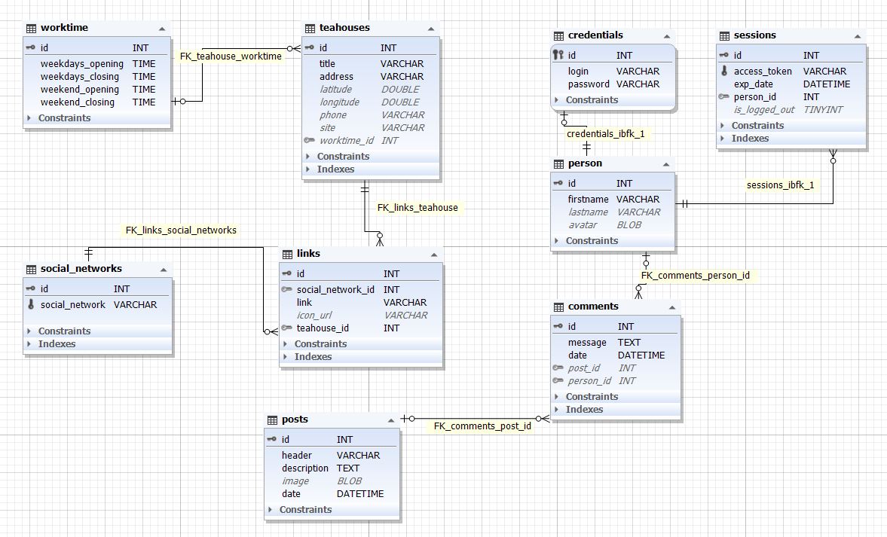

# TEAPP. Back-end

Server-side code for a mobile app TEAPP that helps users find tea shops in Saint Petersburg.

## Technologies we use
- [Kotlin](https://kotlinlang.org/) - programming language.
- [Ktor](https://ktor.io/) - asynchronous framework for creating web applications, HTTP services. and more.
- [Heroku](https://www.heroku.com/) - cloud platform for server.
- [Exposed](https://github.com/JetBrains/Exposed) - ORM framework for Kotlin.
- [MySQL](https://www.mysql.com/) - Database Service

## Root Endpoint

On Cloud, the root endpoint for the public API is `https://teappp.herokuapp.com/`.

## Errors

The TEAPP API can return the following errors:

| Status Code | Description                                                           |
| ----------- | --------------------------------------------------------------------- |
| `403`       | Reached request limit to the API.                                     |
| `404`       | Not found.                                                            |
| `415`       | Unsupported media type.                                               |


## Database



## Requests

#### Get Teahouse Data

Get the data for a tea shop by its `id`.

##### Endpoint

`GET /api/teahouses/{id}`

##### Example Response

```json
{
  "title": "Чайная",
  "address": "г. Санкт-Петербург",
  "coordinates": {
    "latitude": 59.0,
    "longitude": 30.0
  },
  "workTime": {
    "weekdays": {
      "from": "10.00",
      "to": "22.00"
    },
    "weekend": {
      "from": "10.00",
      "to": "22.00"
    }
  },
  "phone": "+7987654321",
  "site": "https://spb.tea.ru",
  "links": [
    {
      "title": "Instagram",
      "link": "https://www.instagram.com/tea",
      "icon_url": null
    },
    {
      "title": "Vk",
      "link": "https://vk.com/tea",
      "icon_url": null
    }
  ],
  "id": 1
}
```

#### Get All Teahouses Data

Returns a json collection of data for all teahouses.

##### Endpoint

`GET /api/teahouses/all`

#### Post Login

Do login if POST Request's body contains valid login-password pair

Returns `403` error if login-password pair is not valid or was not set.

Returns `415` error if request body is unreadable.

#### Endpoint

`POST /login`

#### Get profile

Returns a json data about logged in user

#### Endpoint

`GET /profile`

#### Example Response

```
{
  "firstname": "John",
  "lastname": "Doe";
}
```

#### Notes

We are currently working on authorization and administration.
