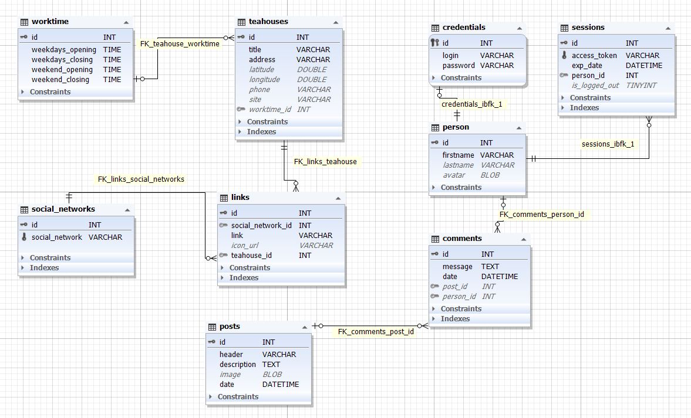

# TEAPP. Back-end

Server-side code for a mobile app TEAPP that helps users find tea shops in Saint Petersburg.

## Technologies we use
- [Kotlin](https://kotlinlang.org/) - programming language.
- [Ktor](https://ktor.io/) - asynchronous framework for creating web applications, HTTP services. and more.
- [Heroku](https://www.heroku.com/) - cloud platform for server.
- [Exposed](https://github.com/JetBrains/Exposed) - ORM framework for Kotlin.
- [MySQL](https://www.mysql.com/) - Database Service

## Root Endpoint

On Cloud, the root endpoint for the public API is `https://teappp.herokuapp.com/`.

## API Rate Limit

We allow a maximum of 5 requests to our API. We are working on a solution to this problem.

## Errors

The TEAPP API can return the following errors:

| Status Code | Description                                                           |
| ----------- | --------------------------------------------------------------------- |
| `403`       | Reached request limit to the API.                                     |
| `404`       | Not found.                                                            |
| `418`       | I'm a teapot.                                                         |

##Database


## Requests

#### Get Teahouse Data

Get the data for a tea shop by its `id`.

##### Endpoint

`GET /api/teahouses/{id}`

##### Example Response

```json
{
  "title": "Мойчай.ру",
  "address": "Лиговский проспект д. 74 оф. 202",
  "coordinates": {
    "latitude": 59.921907,
    "longitude": 30.355705
  },
  "workTime": {
    "weekdays": {
      "from": "10.00",
      "to": "22.00"
    },
    "weekend": {
      "from": "10.00",
      "to": "22.00"
    }
  },
  "phone": "+79585801991",
  "site": "https://spb.moychay.ru",
  "links": [
    {
      "title": "Instagram",
      "link": "https://www.instagram.com/moychayspb/",
      "icon_url": null
    },
    {
      "title": "Vk",
      "link": "https://vk.com/moychayspb/",
      "icon_url": null
    }
  ],
  "id": 1
}
```

#### Get All Teahouses Data

Get the data for all tea shops.

##### Endpoint

`GET /api/teahouses/all`

#### Notes

We are currently working on authorization and administration.